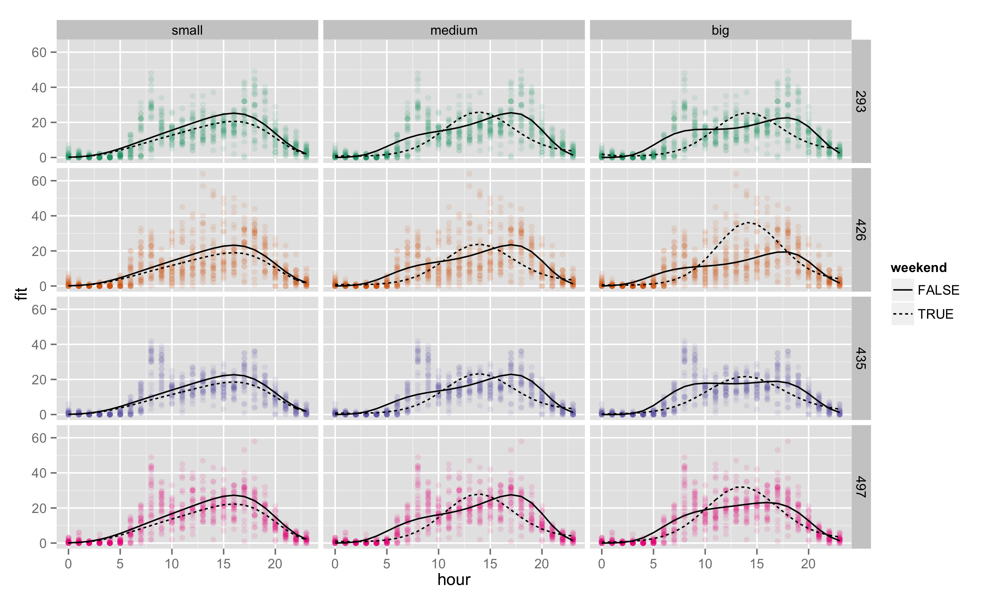

# THOUGHTS and TODO: 
- get data online. Host on my site?
- need something more compelling for `iterators`
- more complicated example for `.combine`? mean?
- do their own code? fix some code?
- images for heavy analysis?
- model search? random forest? svm? other ML topics?
- references
- dorng in my bootstrap?


```{r setup, include=FALSE}
# set global chunk options
library(knitr)
opts_chunk$set(cache=TRUE)
```
# testing slide
<span class='one'>class one</span>

<span class='two'>class two</span>

<span class='three'>class three</span>

<span class='four'>class four</span>

<span class='five'>class five</span>

<span class='six'>class six</span>

<span class='seven'>class seven</span>

<span class='eight'>class eight</span>

<span class='nine'>class nine</span>

<span class='ten'>class ten</span>

<span class='eleven'>class eleven</span>

<span class='twelve'>class twelve</span>

# Why?
## Embarassingly parallel tasks
These are computational tasks which involve many separate, independently executable calculations. Some common statistical examples of embarassingly <span class = 'three'>parallel</span> processes: 

- bootstrapping
- cross-validation 
- simulating independent random variables (`dorng`)

In contrast, some sequential or <span class = 'three'>non-parallel</span> processes:

- MCMC algorithms 
- stepwise model selection (e.g.: `step()`)

For loops that do not explicitly involve dependent calculations are wasteful, especially if we have multiple processors available. Perhaps even worse, the time cost of using a wasteful approach can put some useful statistical tools beyond our reach!

## Options in R
- changing from a for loop to one of the `apply()` functions can help, but still doesn't use multiple processors
- `parallel` package (thanks, Miranda!)
- don't use R
- `foreach` packages!


## Why foreach?
We would like to find a way to make use of our whole computer, and make useful tasks like bootstrapping available to use, but without having to invest large amounts of time in learning new programming languages. Enter `foreach`, which keeps the structure of a for loop, but allows us to drop two key assumptions: 

- sequentiality
- single processor architecture

<span class = 'ten'>**Our goal**</span>: transform a traditional for loop into a foreach loop
We will begin with a simple chunk of R code involving a for loop, and transform it. Along the way, we'll take a look at the equivalent computation done with an `apply()` function, and see that using foreach and multiple processors outperforms this too.

# The data and research question
We are going to look at data from the New York City bikeshare program (Citibike). 

- 7 busiest (on average) locations from May 2014
- response is # of arrivals each hour of every day in the month
- covariates are hour of the day, and whether the day is a weekend

We want to find a model which can offer good prediction. Start with a few plausible models and use K fold cross validation to decide which one to use.

## some nice figures


<!-- loess smoother -->

# Fitting GLMs and extracting prediction error
We now suppose that we're considering three increasingly complex models of the arrival behavior. In order to compare three candidate models prediction error, we'll use K-fold cross validation, where we use the same folds for all three models. 

Here's some familiar code that sets things up:
```{r get_errs, eval=TRUE}
source("~/git/fixschewitt/foreach/citibike_new_york/EDA/subsetting_arrivals_attributes.R")
lq.loss <- function(y, y.hat, q = 1) {(abs(y - y.hat))^q}
get.errs <- function(test.set = NULL,
                     discarded = NULL,
                     q = q) {
    sml.glm <- glm(arrivals ~
                   bs(hour, degree = 4)
                   + weekend
                   + as.factor(id),
                   data = arrivals.sub[-c(discarded, test.set), ],
                   family = "poisson")
    med.glm <- glm(arrivals ~
                   bs(hour, degree = 4)*weekend
                   + as.factor(id),
                   data = arrivals.sub[-c(discarded, test.set), ],
                   family = "poisson")
    big.glm <- glm(arrivals ~
                   bs(hour, degree = 4)*weekend
                   + bs(hour, degree = 4)*as.factor(id),
                   data = arrivals.sub[-c(discarded, test.set), ],
                   family = "poisson")
    sml.err <- mean(lq.loss(predict(object = sml.glm,
                                    newdata = arrivals.sub[test.set, -7],
                                    type = "response"),
                            arrivals.sub[test.set, 7],
                            q = q))
    med.err <- mean(lq.loss(predict(object = med.glm,
                                    newdata = arrivals.sub[test.set, -7],
                                    type = "response"),
                            arrivals.sub[test.set, 7],
                            q = q))
    big.err <- mean(lq.loss(predict(object = big.glm,
                                    newdata = arrivals.sub[test.set, -7],
                                    type = "response"),
                            arrivals.sub[test.set, 7],
                            q = q))
    return(c(sml.err, med.err, big.err))
}
```




Next, we make our K-fold test sets (and implicitly, our training sets):
```{r CV_test_sets}
K <- 50
N <- dim(arrivals.sub)[1]

## kill off 8 observations and make cv test sets
set.seed(1985)
discarded <- sample(1:N, size = 8)
cv.test.sets <- matrix(sample((1:N)[-discarded], size = N - 8), ncol = K)
```

## K-fold CV with a for loop
Using a naive for loop, we could implement this as:
```{r for_loop}
err.for <- NULL
system.time(
    for (i in 1:K) {
        err.for <- cbind(err.for, get.errs(test.set = cv.test.sets[, i],
                                           discarded = discarded,
                                           q = 1))
        }
    )
```


## K-fold CV with an apply function
If you're good with `apply()` functions you might upgrade to
```{r sapply, eval = TRUE}
## apply version
system.time(
    err.apply <- sapply(X = 1:K, 
                        FUN = function(i) {
                            get.errs(test.set = cv.test.sets[, i],
                                     discarded = discarded,
                                     q = 1)
                            }
                        )
    )
```

Neither of the first two methods take advantage of multiple processors. While `apply()` functions avoid the inherently sluggish nature of for loops in `R`, they are still ignorant of the processor structure. We want to chop the job into halves, fourths, etc. and use the _whole_ computer!


## K-fold CV with a foreach loop
Here is the same computation written with a `foreach()` loop
```{r foreach, eval = TRUE}
## foreach version
library(foreach)
library(doParallel)
registerDoParallel(cl = 4)
system.time(
    err.foreach <- foreach(i=1:K,
                           .inorder = FALSE,
                           .combine = "cbind") %dopar% {
                               get.errs(test.set = cv.test.sets[, i],
                                        discarded = discarded,
                                        q = 1)
                               }
    )
```

# Components of a foreach loop
* `%do%` performs the calculations in order, and so uses only one processor. `%dopar%` is what we generally wish to use. 
* arguments to consider
    - `.combine` can take on the intuitive values `c` or `cbind`, as well as more complex functions. Default is to return a list.
    - `.inorder` is a `TRUE/FALSE` argument. Required to be `FALSE` for `%dopar%` to work.
* Notice that unlike `apply()` functions, the `foreach` takes an expression instead of a function.

# Results
```{r errs, include = TRUE, echo=FALSE, dev = 'png', fig.path='../fig/err', fig.show='asis'}
err <- data.frame(t(err.foreach))
names(err) <- c("sml", "med", "big")
library(RColorBrewer)
pal <- brewer.pal(n = 3, name = "Dark2")
plot(density(err$sml), col = pal[1], lwd = 2,
     main = "distribution of absolute errors",
     xlab = "size of error",
     ylab = "density estimate")
lines(density(err$med), col = pal[2], lwd = 2)
lines(density(err$big), col = pal[3], lwd = 2)
legend("topright",
       legend = c("sml", "med", "big"),
       lty = 1, lwd = 2,
       col = pal)
```

# Additional topics

## iterators
Sometimes the list or vector that we are iterating over (in the above case, the vector 1:N) can be a very large object. In our case, the vector is quite reasonable in size, but perhaps the object we were iterating over was a multi-dimensional object, with many values, and a high level of precision. In this case, we'd be storing a massive object, which could potentiall fill up our useable memory and slow things down. We could save memory by only keeping the piece of our list we need for a given calculation, and dumping the rest. This is the idea behind the `iterators` package in R.

Here is our same example with an iterator instead of a list.
```{r iterators_memory}
library(iterators)
registerDoParallel(cl = 4)
system.time(
    err.foreach.iter <- foreach(x = iter(cv.test.sets, by = "col"),
                               .inorder = FALSE,
                               .combine = "cbind") %dopar% {
                                   get.errs(test.set = x,
                                            discarded = discarded,
                                            q = 1)
                                   }
    )
```

## Random numbers
When parallelizing a process which generates random numbers we need to be careful, since we aren't guaranteed that `foreach` will handle this properly. We could wind up getting numbers that aren't in fact random! Moreover, if we want to be able to reproduce an analysis which uses a random number generator, the usual `set.seed()` isn't guaranteed to work.

Fortunately, there is `doRNG`. There are many ways to implement this package, the two easiest of which are:
```{r doRNG_1, eval = TRUE}
library(doRNG)
registerDoParallel(cl = 4)
blah1 <- foreach(x = 1:10, 
                 .options.RNG = 1985,
                 .combine = 'c') %dorng% {
                     rnorm(1)
                     }
```
and 
```{r doRNG_2, eval = TRUE}
registerDoParallel(cl = 4)
registerDoRNG(seed = 1985)
blah2 <- foreach(x = 1:10,
                 .combine = 'c') %dopar% {
    rnorm(1)
    }
```
Note that this gives reproducible results!
```{r same}
sum(blah1 != blah2) 
```

## packages that support foreach
Some packages come with parallel functionality built in via `foreach`.

- `glmnet`
- `gam`
- `ggmcmc` 
- `plyr`
- many others

# Exercise: fix up the following code 
*The following calculation wouldn't typically require parallelization because it isn't a huge task, however we use it for practice's sake.*

Suppose we wish to figure out which of our seven stations had the largest total number of arrivals on each day in May. Fix the following code to do this.
```{r exercise}

```

