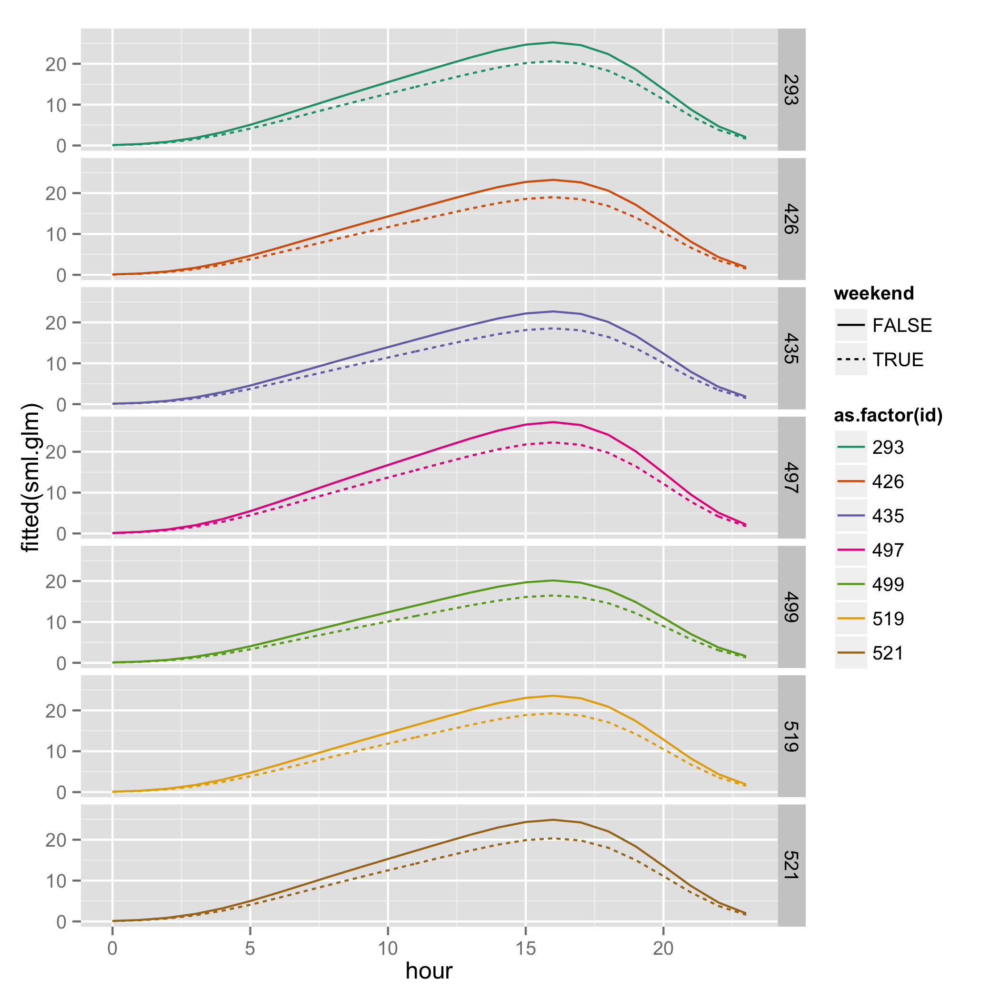
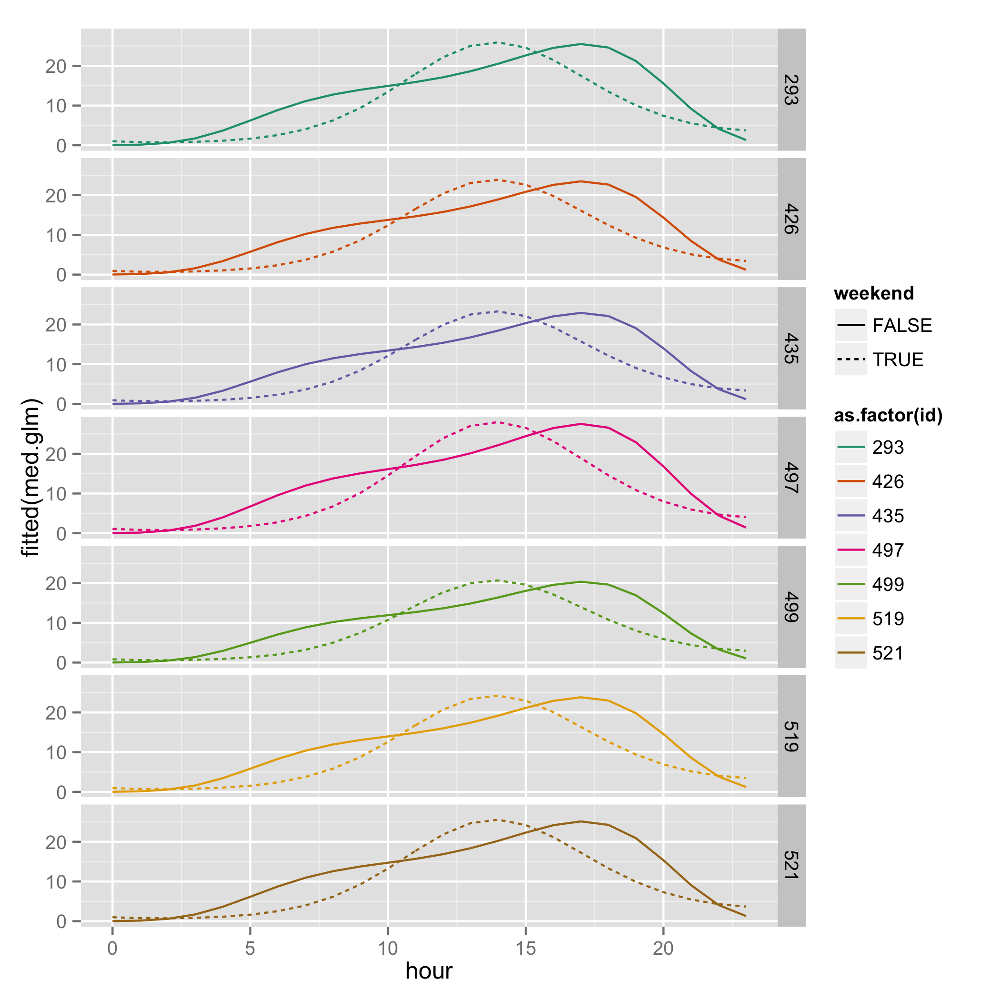
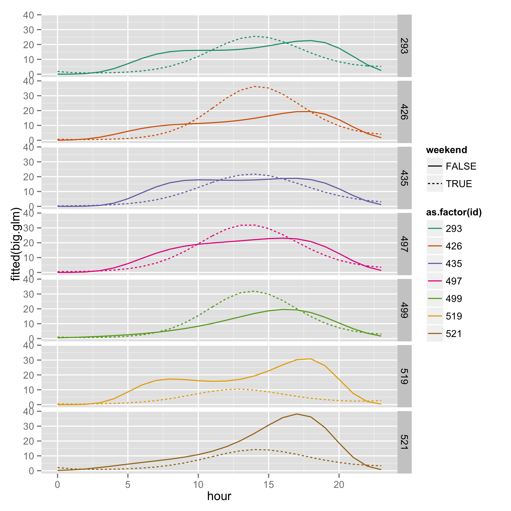

<!---
## THOUGHTS: 
- need something more compelling for `iterators`
- more complicated example for `.combine`? mean?
- do their own code? fix some code?
- images for heavy analysis?
- model search? random forest? svm? other ML topics?
- references
- dorng in my bootstrap?
--->


```{r setup, include=FALSE}
# set global chunk options
library(knitr)
opts_chunk$set(cache=TRUE)
library(highr)
cmd_mine = highr:::cmd_html
cmd_mine[rownames(cmd_mine)=="NUM_CONST", 1] <- '<span class="three">'
opts_knit$set(highr.opts = list(markup = cmd_mine))
cmd_mine
sum(1:2)
```
# testing slide
<span class='three'>class three</span>

# Why?
### Embarassingly parallel tasks
- computational tasks which involve many, separate, independently executable calculations
- common statistical examples of embarassingly parallel processes: 
- bootstrapping
    - cross-validation 
    - simulating independent random variables (`dorng`)
- non-parallel processes: 
    - MCMC algorithms 
    - stepwise model selection (e.g.: `step()`)
- For loops that do not explicitly involve dependent calculations are wasteful, especially if we have multiple processors available
- Perhaps even worse, the time cost of using a wasteful approach can put some useful statistical tools beyond our reach!

# Options in R
- changing from a for loop to one of the `apply()` functions can help, but still doesn't use multiple processors
- `parallel` package (thanks, Miranda!)
- don't use R


# Why foreach?
We would like to find a way to make use of our whole computer, and make useful tasks like bootstrapping available to use, but without having to invest large amounts of time in learning new programming languages. Enter `foreach`, which keeps the structure of a for loop, but allows us to drop two key assumptions: 

- sequentiality
- single processor architecture

## Goal: transform a traditional for loop into a foreach loop
We will begin with a simple chunk of R code involving a for loop, and transform it. Along the way, we'll take a look at the equivalent computation done with an `apply()` function, and see that using foreach and multiple processors outperforms this too.

# The data and research question
We are going to look at data from the New York City bikeshare program (Citibike). 

- 7 busiest (on average) locations from May 2014
- response is # of arrivals each hour of every day in the month
- covariates are hour of the day, and whether the day is a weekend

Goal: find a model which can offer good prediction. Start with a few plausible models and use K fold cross validation to decide which one to use.

## some nice figures


<---! loess smoother --->

# Fitting generalized linear models and extracting prediction error
We now suppose that we're considering three increasingly complex models of the arrival behavior. In order to compare the three models prediction error, we'll use K fold cross validation, where we use the same folds for all three models. 

Here's some familiar code that sets things up:
```{r, eval=TRUE}
source("~/git/fixschewitt/foreach/citibike_new_york/EDA/subsetting_arrivals_attributes.R")

get.errs <- function(test.set = NULL,
                     discarded = NULL) {
    sml.glm <- glm(arrivals ~
                   bs(hour, degree = 4)
                   + weekend
                   + as.factor(id),
                   data = arrivals.sub[-c(discarded, test.set), ],
                   family = "poisson")
    med.glm <- glm(arrivals ~
                   bs(hour, degree = 4)*weekend
                   + as.factor(id),
                   data = arrivals.sub[-c(discarded, test.set), ],
                   family = "poisson")
    big.glm <- glm(arrivals ~
                   bs(hour, degree = 4)*weekend
                   + bs(hour, degree = 4)*as.factor(id),
                   data = arrivals.sub[-c(discarded, test.set), ],
                   family = "poisson")
    sml.err <- mean((predict(object = sml.glm,
                             newdata = arrivals.sub[test.set, -7],
                             type = "response") -
                     arrivals[test.set, 7])^2)
    med.err <- mean((predict(object = med.glm,
                             newdata = arrivals.sub[test.set, -7],
                             type = "response") -
                     arrivals[test.set, 7])^2)
    big.err <- mean((predict(object = big.glm,
                             newdata = arrivals.sub[test.set, -7],
                             type = "response") -
                     arrivals[test.set, 7])^2)
    return(sqrt(c(sml.err, med.err, big.err)))
}
```






Next, we make our K-fold test sets (and implicitly, our training sets):
```{r CV_test_sets}
K <- 50
N <- dim(arrivals.sub)[1]

## kill off 8 observations and make cv test sets
set.seed(1985)
discarded <- sample(1:N, size = 8)
cv.test.sets <- matrix(sample((1:N)[-discarded], size = N - 8), ncol = K)
```

# K fold CV with a for loop
Using a naive for loop, we could implement this as:
```{r for_loop}
err.for <- NULL
system.time(
    for (i in 1:K) {
        err.for <- cbind(err.for, get.errs(test.set = cv.test.sets[, i],
                                           discarded = discarded))
        }
    )
```


# K fold CV with an apply function
If you're good with `apply()` functions you might upgrade to
```{r sapply, eval = TRUE}
## apply version
system.time(
    err.apply <- sapply(X = 1:K, 
                        FUN = function(i) {
                            get.errs(test.set = cv.test.sets[, i],
                                     discarded - discarded)
                            }
                        )
    )
```

Neither of the first two methods take advantage of multiple processors. While `apply()` functions avoid the inherently sluggish nature of for loops in `R`, they are still ignorant of the processor structure. We want to chop the job into halves, fourths, etc. and use the _whole_ computer!


#  K fold CV with a foreach loop
Here is the same computation written with a `foreach()` loop
```{r foreach, eval = TRUE}
## foreach version
library(foreach)
library(doParallel)
registerDoParallel(cl = 4)
system.time(
    err.foreach <- foreach(i=1:K,
                           .inorder = FALSE,
                           .combine = "cbind") %dopar%
                   get.errs(test.set = cv.test.sets[, i],
                            discarded = discarded)
    )
```

# Results


# Components of a foreach loop
* `%do%` and `%dopar%`
* arguments to consider
    - `.combine` can take on the intuitive values `c`, `cbind`, 
    - `.inorder`
    

# iterators
Sometimes the list or vector that we are iterating over (in the above case, the vector 1:N) can be a very large object. In our case, the vector is quite reasonable in size, but perhaps the object we were iterating over was a multi-dimensional object, with many values, and a high level of precision. In this case, we'd be storing a massive object, which could potentiall fill up our useable memory and slow things down. We could save memory by only keeping the piece of our list we need for a given calculation, and dumping the rest. This is the idea behind the `iterators` package in R.

## Our same example with an iterator instead of a list

```{r iterators_memory}
library(iterators)
registerDoParallel(cl = 4)
system.time(
    err.foreach.iter <- foreach(x = iter(cv.test.sets, by = "col"),
                               .inorder = FALSE,
                               .combine = "cbind") %dopar%
                        get.errs(test.set = x,
                                    discarded = discarded)
    )
```

# Fix up the following code 

```{r fix_up, eval=FALSE}
random_
registerDoParallel(cl = __)

```

