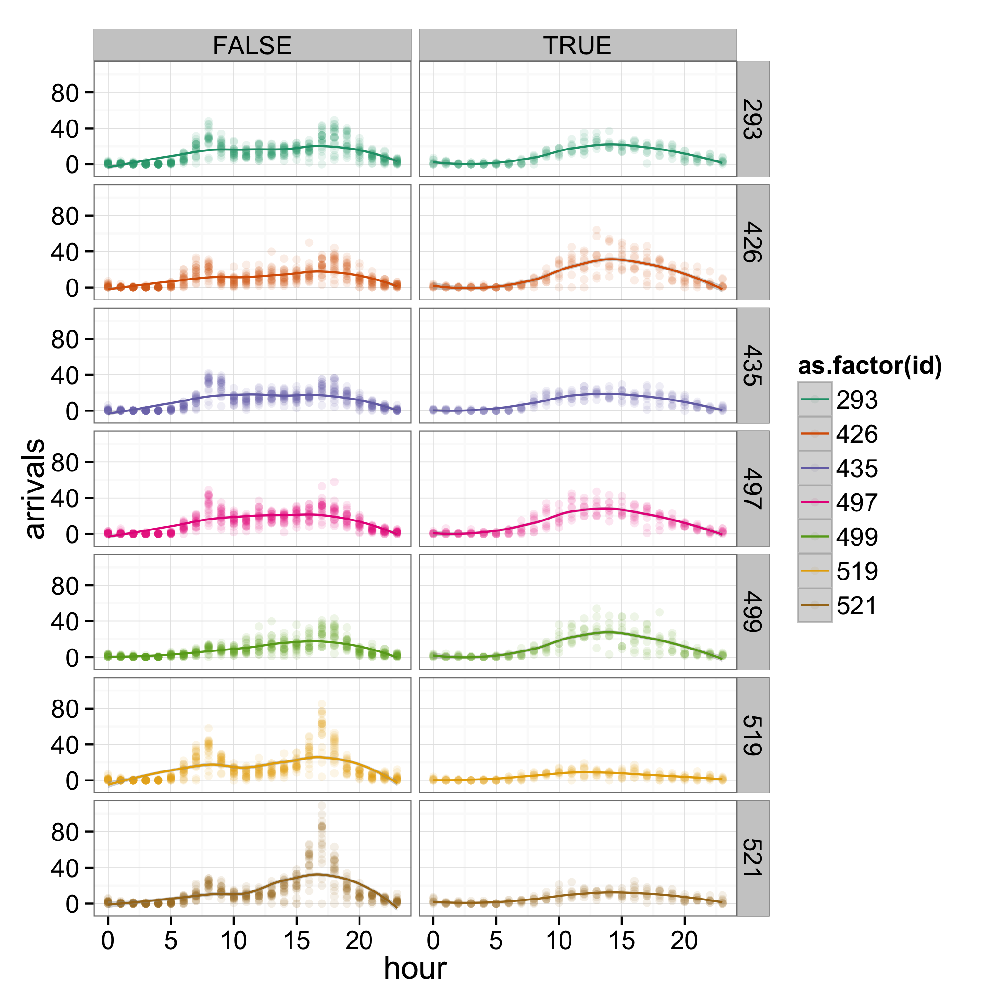
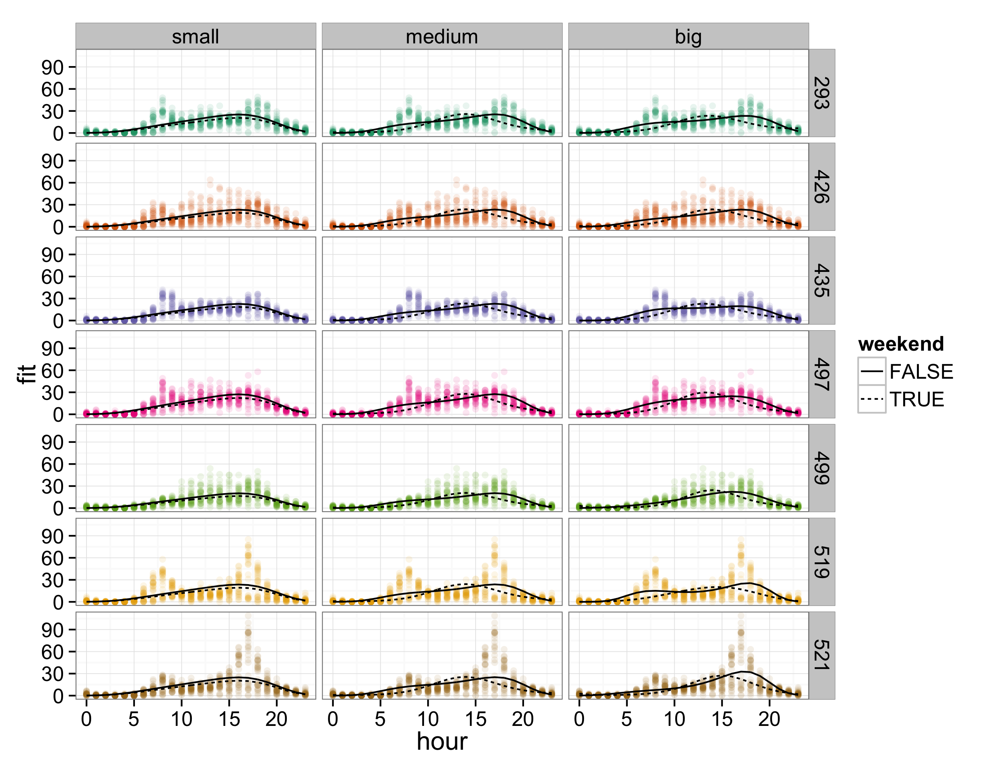
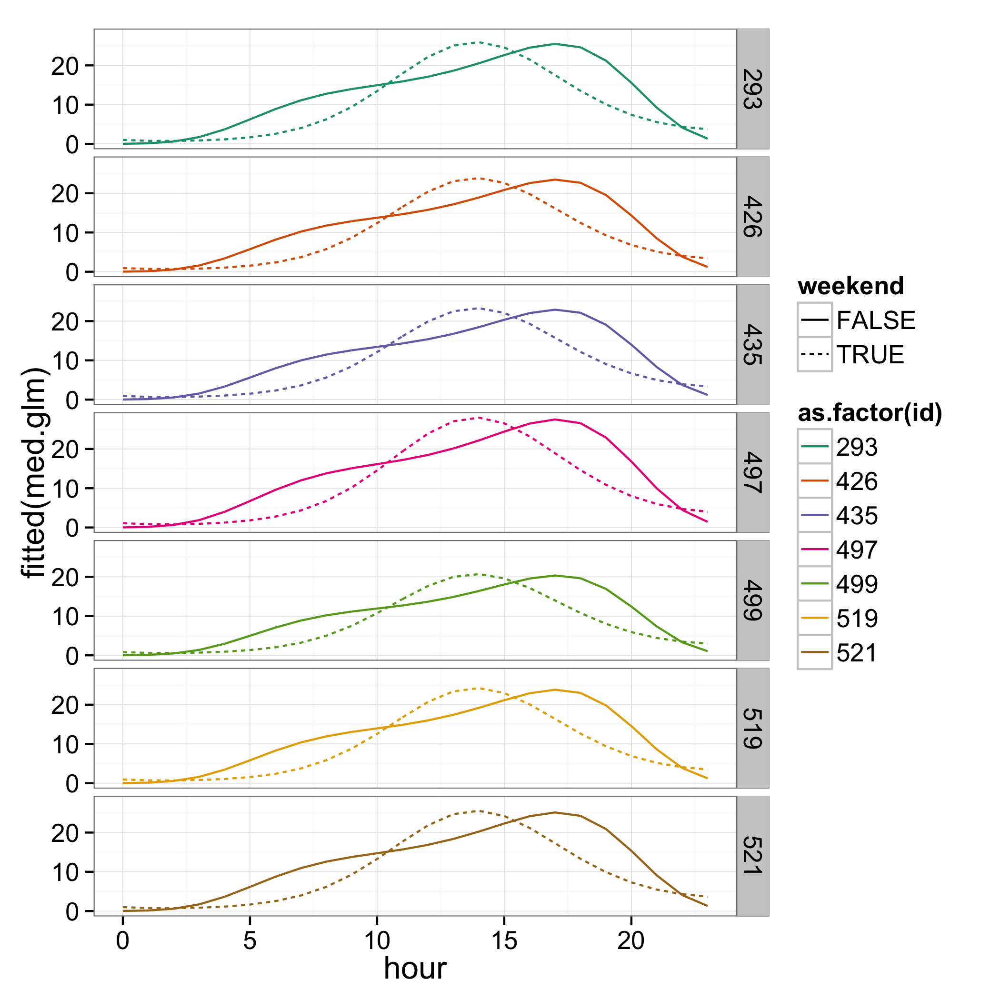
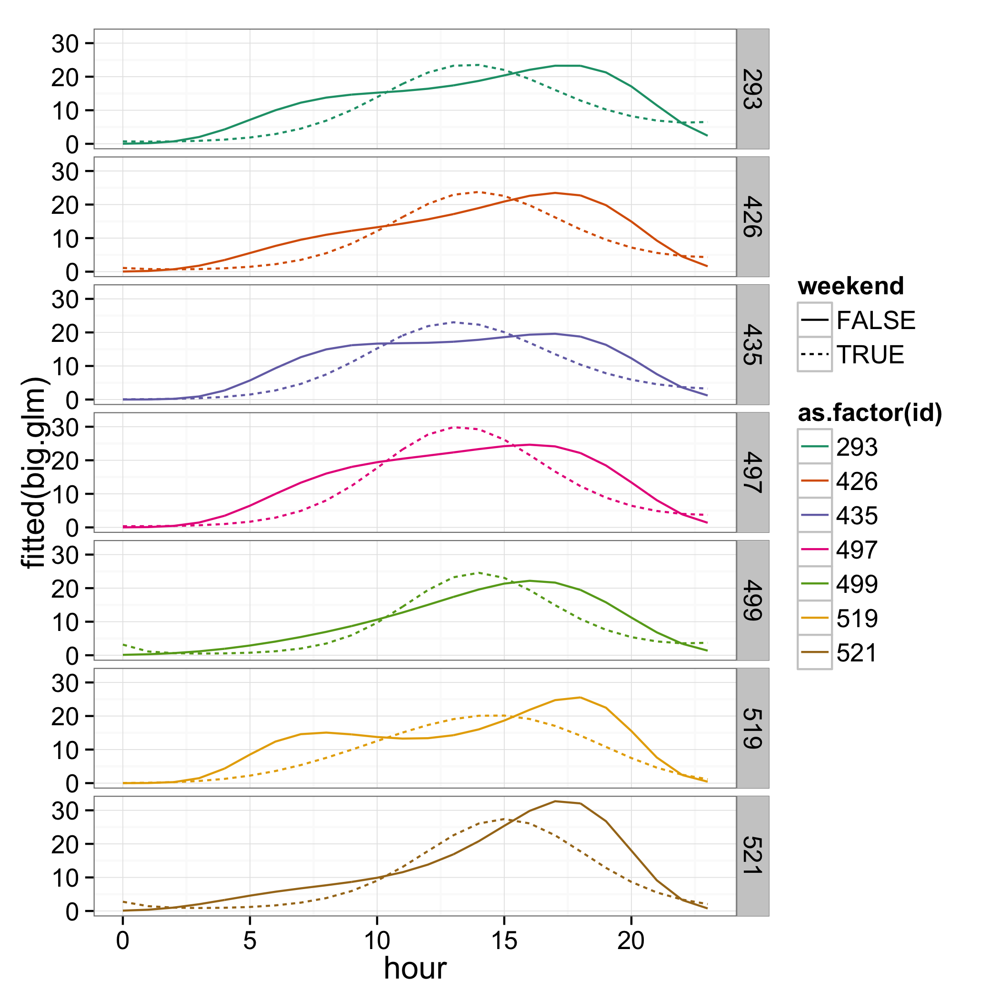

# moving from for to foreach
Henry Scharf  
December 4, 2014  


<!--
# THOUGHTS and TODO: 
- need something more compelling for `iterators`
- more complicated example for `.combine`? mean?
- images for heavy analysis?
- references
-->


<!--
<span class='one'>class one</span>
<span class='two'>class two</span>
<span class='three'>class three</span>
<span class='four'>class four</span>
<span class='five'>class five</span>
<span class='six'>class six</span>
<span class='seven'>class seven</span>
<span class='eight'>class eight</span>
<span class='nine'>class nine</span>
<span class='ten'>class ten</span>
<span class='eleven'>class eleven</span>
<span class='twelve'>class twelve</span>
-->

# why?
## embarassingly parallel tasks
These are computational tasks which involve many separate, independently executable calculations. Some common statistical examples of embarassingly <span class = 'eleven'>**parallel**</span> processes: 

- bootstrapping
- cross-validation 
- simulating independent random variables (`dorng`)

In contrast, some sequential or <span class = 'eleven'>**non-parallel**</span> processes:

- MCMC algorithms 
- several types of model selection (e.g.: `step()` or the LARS algorithm for LASSO)

`for` loops that do not explicitly involve dependent calculations are wasteful if we have multiple processors available. Perhaps even worse, the time cost of using such an approach can put some useful statistical tools beyond our reach!

## options
- Changing from a for loop to one of the `apply()` functions can help, but still doesn't use multiple processors.
- Use the `parallel` package (thanks, Miranda!).
- Don't use R.
- Use the `foreach` package!


## why foreach?
We would like to find a way to make use of our whole computer, and make valuable tasks like bootstrapping available, but without having to invest large amounts of time in learning new programming languages. Enter `foreach`, which keeps the structure of a for loop, but allows us to drop two key assumptions: 

- sequentiality
- single processor architecture

<span class = 'ten'>**Our goal**</span>: 
We will begin with a simple chunk of R code involving a for loop and transform it into a `foreach` loop. Along the way, we'll take a look at the equivalent computation done with an `apply()` function, and see that using `foreach` and multiple processors outperforms this.

# example: data and research question
We are going to look at data from the New York City bikeshare program [Citibike](https://www.citibikenyc.com/). 

- 7 busiest locations from May 2014
- response: # of arrivals each hour of every day in the month
- covariates: hour of the day and whether the day is a weekend

One of the costliest parts of operating a bike share program comes from the finiteness of the bicycle stations. A station can only hold so many bicycles, and a full (empty) station means customers cannot drop off (pick up) a bike. Thus, managers are forced to use trucks to manually redistribute bicycles.

We want to find a model which can offer good prediction, with the hope that this will inform our plans for future station locations/sizes. For this example, we start with a few plausible models and use K-fold cross validation to decide which one to use.

## locations of our 7 sites


****
## data


****
# fitting GLMs and extracting prediction error
We are considering three increasingly complex models of the arrival behavior. In order to compare three candidate models' prediction error, we'll use K-fold cross validation, where we use the same folds for all three models. 

First, we the load the data and make our K-fold test sets (and implicitly, our training sets):

```r
load(url("http://www.stat.colostate.edu/~scharfh/CSP_parallel/data/arrivals_subset.RData"))
K <- 50
N <- dim(arrivals.sub)[1]

## for convenience kill off 8 observations (we have 5208) and make cv test sets
set.seed(1985)
discarded <- sample(1:N, size = 8)
cv.test.sets <- matrix(sample((1:N)[-discarded], size = N - 8), ncol = K)
```

Next, we build a function to fit the data to the training sets and extract the corresponding estimate of prediciton error. This should still be familiar code, no new packages yet.

```r
lq.loss <- function(y, y.hat, q = 1) {(abs(y - y.hat))^q}
get.errs <- function(test.set = NULL,
                     discarded = NULL,
                     q = 1) {
    sml.glm <- glm(arrivals ~
                   bs(hour, degree = 4)
                   + weekend
                   + as.factor(id),
                   data = arrivals.sub[-c(discarded, test.set), ],
                   family = "poisson")
    med.glm <- glm(arrivals ~
                   bs(hour, degree = 4)*weekend
                   + as.factor(id),
                   data = arrivals.sub[-c(discarded, test.set), ],
                   family = "poisson")
    big.glm <- glm(arrivals ~
                   bs(hour, degree = 4)*weekend
                   + bs(hour, degree = 4)*as.factor(id),
                   data = arrivals.sub[-c(discarded, test.set), ],
                   family = "poisson")
    sml.err <- mean(lq.loss(predict(object = sml.glm,
                                    newdata = arrivals.sub[test.set, -7],
                                    type = "response"),
                            arrivals.sub[test.set, 7],
                            q = q))
    med.err <- mean(lq.loss(predict(object = med.glm,
                                    newdata = arrivals.sub[test.set, -7],
                                    type = "response"),
                            arrivals.sub[test.set, 7],
                            q = q))
    big.err <- mean(lq.loss(predict(object = big.glm,
                                    newdata = arrivals.sub[test.set, -7],
                                    type = "response"),
                            arrivals.sub[test.set, 7],
                            q = q))
    return(c(sml.err, med.err, big.err))
}
```

The fits using all the data look like:


<!--



-->

## K-fold CV with a for loop
Using a naive for loop, we could implement this as:

```r
err.for <- NULL
system.time(
    for (i in 1:K) {
        err.for <- cbind(err.for, get.errs(test.set = cv.test.sets[, i],
                                           discarded = discarded,
                                           q = 1))
        }
    )
```

```
##    user  system elapsed 
##  20.481   0.884  22.820
```


## K-fold CV with an apply function
If you're good with `apply()` functions you might upgrade (slightly) to

```r
## apply version
system.time(
    err.apply <- sapply(X = 1:K, 
                        FUN = function(i) {
                            get.errs(test.set = cv.test.sets[, i],
                                     discarded = discarded,
                                     q = 1)
                            }
                        )
    )
```

```
##    user  system elapsed 
##  18.930   0.829  20.147
```

Neither of the first two methods take advantage of multiple processors. While the `apply()` functions avoid the inherently sluggish nature of for loops in `R`, they are still ignorant of the processor structure. We want to chop the job into halves, fourths, etc. and use the _whole_ computer!


## K-fold CV with a foreach loop
Here is the same computation written with a `foreach` loop

```r
## foreach version
library(foreach)
library(doParallel)
```

```
## Loading required package: iterators
## Loading required package: parallel
```

```r
registerDoParallel(cl = 2)
system.time(
    err.foreach <- foreach(i=1:K,
                           .inorder = FALSE,
                           .combine = "cbind") %dopar% {
                               get.errs(test.set = cv.test.sets[, i],
                                        discarded = discarded,
                                        q = 1)
                               }
    )
```

```
##    user  system elapsed 
##  11.449   0.545  12.573
```

# components of a foreach loop
Note that despite the syntactically similar structure, `foreach()` is a different animal than `for`. It is a function with several important arguments. The first is the object we iterate over and functions like the `(i in 1:K)` in the for loop. The rest of the structure is new:

- `%___%`
    - `%do%` performs the calculations in order and uses only one processor.
    - `%dopar%` is what we generally wish to use.
    - `%dorng%` will be discussed later, and is required for procedures that use randomly generated numbers.
    - `%:%` can be used for nesting loops, which we'll see in an example at the end of the tutorial.
- arguments
    - `.combine` can take on the intuitive values `'c'`, `'cbind'`, or `'+'` as well as more complex functions and tells `foreach` how to combine the outputs from each iteration. The default is to return a list.
    - `.inorder` is a `TRUE`/`FALSE` argument. In general, it is better to change this from the default of `TRUE` to `FALSE` whenever possible.
- Notice that unlike `apply()` functions, the `foreach` takes an expression (in braces after `%dopar%`) instead of a function.

# results


# additional topics

## iterators
Sometimes the list or vector that we are iterating over (in the above case, the vector `1:K`) can be a very large object. In our case the vector is quite reasonable in size, but the object we are iterating over could instead be a multi-dimensional object with many values and a high level of precision. In this case, we'd be storing a complete copy of this massive object for each processor, which could potentially fill up our memory and slow things down. We could save memory by only keeping the piece of our list we need for a given calculation as they are computed, and dumping the rest. This is the idea behind the `iterators` package in R.

Here is our same example with an iterator instead of a list. 

```r
library(iterators)
registerDoParallel(cl = 2)
system.time(
    err.foreach.iter <- foreach(x = iter(cv.test.sets, by = "col"),
                               .inorder = FALSE,
                               .combine = "cbind") %dopar% {
                                   get.errs(test.set = x,
                                            discarded = discarded,
                                            q = 1)
                                   }
    )
```

```
##    user  system elapsed 
##  22.666   1.075  12.571
```
Iterators can also be used to keep from ever having to store even a single copy of the object. For more on these, see [Using the foreach package](http://cran.r-project.org/web/packages/foreach/vignettes/foreach.pdf) and [Using the iterators package](http://cran.r-project.org/web/packages/iterators/vignettes/iterators.pdf).

## random numbers
When parallelizing a process which generates random numbers we need to be careful, since we aren't guaranteed that `foreach` will handle this properly. We could wind up getting numbers that aren't in fact random! Moreover, if we want to be able to reproduce an analysis which uses a random number generator, the usual `set.seed()` isn't guaranteed to work.

Fortunately, there is `doRNG`. There are many ways to implement this package, the two easiest of which are:

```r
library(doRNG)
```

```
## Loading required package: rngtools
## Loading required package: pkgmaker
## Loading required package: registry
```

```r
registerDoParallel(cl = 2)
blah1 <- foreach(x = 1:10, 
                 .options.RNG = 1985,
                 .combine = 'c') %dorng% {
                     rnorm(1)
                     }
```
and 

```r
registerDoParallel(cl = 2)
registerDoRNG(seed = 1985)
blah2 <- foreach(x = 1:10,
                 .combine = 'c') %dopar% {
    rnorm(1)
    }
```
Note that this gives reproducible results!

```r
sum(blah1 != blah2) 
```

```
## [1] 0
```

## packages that support foreach
Some packages come with parallel functionality built in via `foreach`.

- `glmnet`
- `gam`
- `ggmcmc` 
- `plyr`
- many others: see [reverse suggests](http://cran.r-project.org/web/packages/foreach/index.html)

# <span class="ten">exercise</span>: fix up the following code 
The following calculation wouldn't typically require parallelization because it isn't a huge task, however we use it for practice's sake.

Suppose we wish to figure out which day in May had the most combined arrivals across these seven stations. Here's a function to get started, you're welcome to scrap it for your own, or use it and fill in the gaps in what follows.

```r
sum.arrivals <- function(date = NULL,
                         id = NULL){
    sum.arr <- sum(arrivals.sub$arrivals[arrivals.sub$date == date &
                                         arrivals.sub$id == id])
    return(sum.arr)
}
```
The following code needs some help. When nesting `foreach` loops ([see this vignette](http://cran.r-project.org/web/packages/foreach/vignettes/nested.pdf)), we need to use `%:%`. Fill in the missing parts to make the code work.


```r
system.time(
    registerDoParallel(cl = 2)
    busiest <- foreach(date = ___,
                       ._______ = FALSE,
                       .combine = ___) %:%
                           foreach(id = unique(arrivals.sub$id),
                                   .inorder = ______,
                                   .combine = ___) %_____% {
                                       sum.arrivals(date = date,
                                                    id = id)
                                   }
                       }
    )
which(busiest==max(busiest))    
```
For something this small, the overhead of managing the parallelization means a regular nested for loop is quicker.

```r
sum.arrivals <- function(date = NULL,
                         id = NULL){
    sum.arr <- sum(arrivals.sub$arrivals[arrivals.sub$date == date &
                                         arrivals.sub$id == id])
    return(sum.arr)
}
busiest.for <- rep(0, 31)
system.time(
    for(date in 1:31){
        for(id in unique(arrivals.sub$id)){
            busiest.for[date] <- sum(busiest.for[date],
                                     sum.arrivals(date = date, id = id))
        }
    }
    )
```

```
##    user  system elapsed 
##   0.078   0.004   0.083
```

```r
which(busiest.for==max(busiest.for))    
```

```
## [1] 20
```


# <span class = "nine">references</span>

## Other tutorials
[Getting Started with doParallel and foreach](http://cran.r-project.org/web/packages/doParallel/vignettes/gettingstartedParallel.pdf)

[Using the foreach package](http://cran.r-project.org/web/packages/foreach/vignettes/foreach.pdf)

[Using the iterators package](http://cran.r-project.org/web/packages/iterators/vignettes/iterators.pdf)

[Nesting foreach loops](http://cran.r-project.org/web/packages/foreach/vignettes/nested.pdf)

## Data 
[citibike system data](https://www.citibikenyc.com/system-data)
