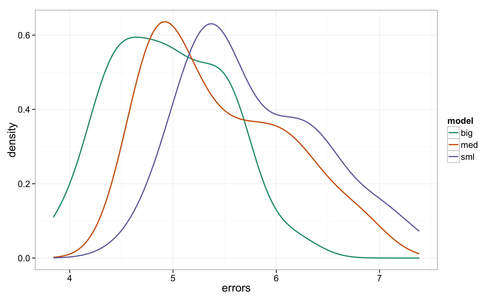

```{r setup, include=FALSE}
# set global chunk options
library(knitr)
opts_chunk$set(cache=FALSE)
```

# why?
## embarassingly parallel tasks {.build}
<span class = 'eleven'>**parallel**</span> processes: 

- bootstrapping
- cross-validation 
- simulating independent random variables (`dorng`)

<span class = 'eleven'>**non-parallel**</span> processes:

- MCMC algorithms 
- several types of model selection (e.g.: `step()` or the LARS algorithm for LASSO)

## what to do {.build}
### options 
- Changing from a for loop to one of the `apply()` functions can help, but still doesn't use multiple processors.
- Use the `parallel` package (thanks, Miranda!).
- Don't use R.
- Use the `foreach` package!

### why foreach?
- Make use of our whole computer
- Without having to invest large amounts of time in learning new programming languages
- <span class = 'ten'>**Our goal**</span>: transform a for loop into a foreach loop

# data and research question
## citibike nyc {.build}
<div class='columns-2'>
**Goal**: predict arrival volume to inform management of bike stations

- 7 busiest locations from May 2014
- response: # of arrivals each hour of every day in the month
- covariates: hour of the day and whether the day is a weekend


</div>

## {.centered}


# fitting GLMs and extracting prediction error | three models
## the Goldilocks approach{.build}

Use K-fold cross validation to compare prediction error.
```{r get_errs, eval=TRUE, echo = FALSE}
load(url("http://www.stat.colostate.edu/~scharfh/CSP_parallel/data/arrivals_subset.RData"))
lq.loss <- function(y, y.hat, q = 1) {(abs(y - y.hat))^q}
get.errs <- function(test.set = NULL,
                     discarded = NULL,
                     q = 1) {
    sml.glm <- glm(arrivals ~
                   bs(hour, degree = 4)
                   + weekend
                   + as.factor(id),
                   data = arrivals.sub[-c(discarded, test.set), ],
                   family = "poisson")
    med.glm <- glm(arrivals ~
                   bs(hour, degree = 4)*weekend
                   + as.factor(id),
                   data = arrivals.sub[-c(discarded, test.set), ],
                   family = "poisson")
    big.glm <- glm(arrivals ~
                   bs(hour, degree = 4)*weekend*as.factor(id),
                   data = arrivals.sub[-c(discarded, test.set), ],
                   family = "poisson")
    sml.err <- mean(lq.loss(predict(object = sml.glm,
                                    newdata = arrivals.sub[test.set, -7],
                                    type = "response"),
                            arrivals.sub[test.set, 7],
                            q = q))
    med.err <- mean(lq.loss(predict(object = med.glm,
                                    newdata = arrivals.sub[test.set, -7],
                                    type = "response"),
                            arrivals.sub[test.set, 7],
                            q = q))
    big.err <- mean(lq.loss(predict(object = big.glm,
                                    newdata = arrivals.sub[test.set, -7],
                                    type = "response"),
                            arrivals.sub[test.set, 7],
                            q = q))
    return(c(sml.err, med.err, big.err))
}
```

```{r get_errs_display1, eval=FALSE, echo = TRUE}
load(url("http://www.stat.colostate.edu/~scharfh/CSP_parallel/data/arrivals_subset.RData"))
lq.loss <- function(y, y.hat, q = 1) {(abs(y - y.hat))^q}
get.errs <- function(test.set = NULL,
                     discarded = NULL,
                     q = 1) {
    sml.glm <- glm(arrivals ~
                   bs(hour, degree = 4)
                   + weekend
                   + as.factor(id),
                   data = arrivals.sub[-c(discarded, test.set), ],
                   family = "poisson")
    med.glm <- glm(arrivals ~
                   bs(hour, degree = 4)*weekend
                   + as.factor(id),
                   data = arrivals.sub[-c(discarded, test.set), ],
                   family = "poisson")
    ```

##
```{r get_errs_display2, eval=FALSE, echo = TRUE}
    big.glm <- glm(arrivals ~
                   bs(hour, degree = 4)*weekend*as.factor(id),
                   data = arrivals.sub[-c(discarded, test.set), ],
                   family = "poisson")
    sml.err <- mean(lq.loss(predict(object = sml.glm,
                                    newdata = arrivals.sub[test.set, -7],
                                    type = "response"),
                            arrivals.sub[test.set, 7],
                            q = q))
    med.err <- mean(lq.loss(predict(object = med.glm,
                                    newdata = arrivals.sub[test.set, -7],
                                    type = "response"),
                            arrivals.sub[test.set, 7],
                            q = q))
    big.err <- mean(lq.loss(predict(object = big.glm,
                                    newdata = arrivals.sub[test.set, -7],
                                    type = "response"),
                            arrivals.sub[test.set, 7],
                            q = q))
    return(c(sml.err, med.err, big.err))
}
```

## {.centered}


## Make our K-fold test sets | and implicitly, our training sets
```{r CV_test_sets}
K <- 50
N <- dim(arrivals.sub)[1]

## for convenience kill off 8 observations (we have 5208) and make cv test sets
set.seed(1985)
discarded <- sample(1:N, size = 8)
cv.test.sets <- matrix(sample((1:N)[-discarded], size = N - 8), ncol = K)
```

## K-fold CV with a for loop {.build}
Using a naive for loop, we could implement this as:
```{r for_loop}
err.for <- NULL
system.time(
    for (i in 1:K) {
        err.for <- cbind(err.for, get.errs(test.set = cv.test.sets[, i],
                                           discarded = discarded,
                                           q = 1))
        }
    )
```

## K-fold CV with an apply function {.build}
If you're good with `apply()` functions you might upgrade to
```{r sapply, eval = TRUE}
system.time(
    err.apply <- sapply(X = 1:K, 
                        FUN = function(i) {
                            get.errs(test.set = cv.test.sets[, i],
                                     discarded = discarded,
                                     q = 1)
                            }
                        )
    )
```

Both of these assume a single processor architecture. We want to chop the job into halves, fourths, etc. and use the _whole_ computer!

## K-fold CV with a foreach loop {.build}
```{r foreach_pre, eval = TRUE, message=FALSE}
library(foreach)
library(doParallel)
```

```{r foreach, eval=TRUE}
registerDoParallel(cl = 2)
system.time(
    err.foreach <- foreach(i=1:K,
                           .inorder = FALSE,
                           .combine = "cbind") %dopar% {
                               get.errs(test.set = cv.test.sets[, i],
                                        discarded = discarded,
                                        q = 1)
                               }
    )
```

# the breakdown
## components of a foreach loop
- `registerDoParallel(cl = 2)`
- `%___%`
    - `%do%` performs the calculations in order and uses only one processor.
    - `%dopar%` is what we generally wish to use.
    - `%dorng%` will be discussed later, and is required for procedures that use randomly generated numbers.
    - `%:%` can be used for nesting loops, which we'll see in an example at the end of the tutorial.
    
## `foreach()` is a function {.build}
### arguments

- `.combine` can take on the intuitive values `'c'`, `'cbind'`, or `'+'` as well as more complex functions and tells `foreach` how to combine the outputs from each iteration. The default is to return a list.    
- `.inorder` is a `TRUE`/`FALSE` argument. In general, it is better to change this from the default of `TRUE` to `FALSE` whenever possible.

### Notice that unlike `apply()` functions, the `foreach` takes an expression (in braces after `%dopar%`) instead of a function.

# results
<!--
have knitr do the results - sucks 
```{r errs, include = TRUE, echo=FALSE, dev = 'png', fig.path='../fig/', fig.show='asis'}
err <- data.frame(t(err.foreach))
names(err) <- c("sml", "med", "big")
library(RColorBrewer)
pal <- brewer.pal(n = 3, name = "Dark2")
plot(density(err$sml), col = pal[1], lwd = 2,
     main = "distribution of absolute errors",
     xlab = "size of error",
     ylab = "density estimate")
lines(density(err$med), col = pal[2], lwd = 2)
lines(density(err$big), col = pal[3], lwd = 2)
legend("topright",
       legend = c("sml", "med", "big"),
       lty = 1, lwd = 2,
       col = pal)
```
-->

## {.centered}


# additional topics

## iterators: smart memory use {.build}
<!--
Sometimes the list or vector that we are iterating over (in the above case, the vector `1:K`) can be a very large object. In our case the vector is quite reasonable in size, but the object we are iterating over could instead be a multi-dimensional object with many values and a high level of precision. In this case, we'd be storing a complete copy of this massive object for each processor, which could potentially fill up our memory and slow things down. We could save memory by only keeping the piece of our list we need for a given calculation as they are computed, and dumping the rest. This is the idea behind the `iterators` package in R.
-->

Here is our same example with an iterator instead of a list. 
```{r iterators_memory}
library(iterators)
registerDoParallel(cl = 2)
system.time(
    err.foreach.iter <- foreach(x = iter(cv.test.sets, by = "col"),
                               .inorder = FALSE,
                               .combine = "cbind") %dopar% {
                                   get.errs(test.set = x,
                                            discarded = discarded,
                                            q = 1)
                                   }
    )
```
<!--
Iterators can also be used to keep from ever having to store even a single copy of the object. For more on these, see [Using the foreach package](http://cran.r-project.org/web/packages/foreach/vignettes/foreach.pdf) and [Using the iterators package](http://cran.r-project.org/web/packages/iterators/vignettes/iterators.pdf).
-->

## random numbers {.build}

There are many ways to implement `doRNG`, the two easiest of which are:
```{r doRNG_1, eval = TRUE, message=FALSE}
library(doRNG)
registerDoParallel(cl = 2)
blah1 <- foreach(x = 1:10, 
                 .options.RNG = 1985,
                 .combine = 'c') %dorng% {
                     rnorm(1)
                     }
```
and 
```{r doRNG_2, eval = TRUE}
registerDoParallel(cl = 2)
registerDoRNG(seed = 1985)
blah2 <- foreach(x = 1:10,
                 .combine = 'c') %dopar% {
                     rnorm(1)
                     }
```
## random numbers
Note that this gives reproducible results!
```{r same}
sum(blah1 != blah2) 
```

## packages that support foreach
Some packages come with parallel functionality built in via `foreach`.

- `glmnet`
- `gam`
- `ggmcmc` 
- `plyr`
- many others: see [reverse suggests](http://cran.r-project.org/web/packages/foreach/index.html) on `foreach`'s CRAN page.

# <span class="ten">exercise</span>

## a summary statistic
The following calculation wouldn't typically require parallelization because it isn't a huge task, however we use it for practice's sake.

Suppose we wish to figure out which day in May had the most combined arrivals across these seven stations. Here's a function to get started, you're welcome to scrap it for your own, or use it and fill in the gaps in what follows.
```{r sum_arrivals, eval = TRUE}
sum.arrivals <- function(date = NULL,
                         id = NULL){
    sum.arr <- sum(arrivals.sub$arrivals[arrivals.sub$date == date &
                                         arrivals.sub$id == id])
    return(sum.arr)
}
```
## fix up the following code  {.build}

The following code needs some help. When nesting `foreach` loops ([see this vignette](http://cran.r-project.org/web/packages/foreach/vignettes/nested.pdf)), we need to use `%:%`. Fill in the missing parts to make the code work.

```{r exercise_foreach, eval = FALSE}
library(doParallel)
registerDoParallel(cl = _)
system.time(
    busiest <- foreach(date = ___,
                       ._______ = FALSE,
                       .combine = ___) %:%
                           foreach(id = unique(arrivals.sub$id),
                                   .inorder = _____,
                                   .combine = ___) %_____% {
                                       sum.arrivals(date = date,
                                                    id = id)
                                   }
                       }
    )
which(busiest==max(busiest))    
```

## one answer
```{r exercise_answer, eval = TRUE}
registerDoParallel(cl = 4)
system.time(
    busiest <- foreach(date = 1:31,
                       .inorder = FALSE,
                       .combine = 'c') %:%
                           foreach(id = unique(arrivals.sub$id),
                                   .inorder = FALSE,
                                   .combine = '+') %dopar% {
                                       sum.arrivals(date = date,
                                                    id = id)
                                   })
which(busiest==max(busiest))    
```

## too much overhead
```{r exercise_for}
busiest.for <- rep(0, 31)
system.time(
    for(date in 1:31){
        for(id in unique(arrivals.sub$id)){
            busiest.for[date] <- sum(busiest.for[date],
                                     sum.arrivals(date = date, id = id))
        }
    }
    )
which(busiest.for==max(busiest.for))    
```

## Thanks!


## <span class = "nine">references</span>

### Other tutorials
[Getting Started with doParallel and foreach](http://cran.r-project.org/web/packages/doParallel/vignettes/gettingstartedParallel.pdf)

[Using the foreach package](http://cran.r-project.org/web/packages/foreach/vignettes/foreach.pdf)

[Using the iterators package](http://cran.r-project.org/web/packages/iterators/vignettes/iterators.pdf)

[Nesting foreach loops](http://cran.r-project.org/web/packages/foreach/vignettes/nested.pdf)

### Data 
[citibike system data](https://www.citibikenyc.com/system-data)
