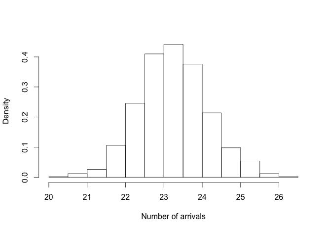

```{r setup, include=FALSE}
# set global chunk options
library(knitr)
opts_chunk$set(cache=FALSE)
opts_chunk$set(eval=TRUE)
```

# Why?

## Why parallel?

- Use your whole computer for embarassingly parallel tasks
- Large gain in efficiency for a small amount of effort

## Why `parallel`?

The `parallel` package merges `multicore` and `snow`

- Ships with recent versions of R
- Provides drop-in replacements for most of their functionality, with integrated handling of random-number generation
- By default, uses `multicore` functionality on Unix-like systems and `snow` functionality on Windows
- (We can also use the `snow` functionality to execute on a cluster for both systems)

# Getting started

## Parallel backend {.build}
Make the desired number of cores available to R:

```{r clustersetup, message=FALSE}
require(doParallel)

# Determine number of CPU cores in your machine
nCores = detectCores()

# Create cluster with desired number of cores
cl = makeCluster(nCores)

# Register cluster
registerDoParallel(cl)

```

## Parallel apply

- `foreach` parallelizes `for` loops
- `parallel` does the same for `apply` functions

## Parallel apply {.build}

Consider this simple example:

```{r testfun}
input = 1:100
input.list = as.list(input)

testFun = function(i){
  mu = mean(runif(1e+06, 0, i))
  return(mu)
}
```

(There is something wrong here... we'll come back to this.)

## Parallel apply {.build}
How would we do this with `foreach`?

```{r foreach}
system.time(
  mu.foreach <- foreach(i=1:100,
                     .combine = "c") %dopar% {
                          testFun(i)
                        }
)
```

## Parallel apply {.build}
Now let's try it with `sapply` and `parSapply`

```{r sapply.1}
system.time(
  sapply(input, testFun)
  )
```

```{r sapply.2}
system.time(
  parSapply(cl, input, testFun)
  )
```

## Parallel apply {.build}
Now let's try it with `lapply` and `parLapply`

```{r lapply.1}
system.time(
  lapply(input.list, testFun)
  )
```

```{r lapply.2}
system.time(
  parLapply(cl, input.list, testFun)
  )
```

## Parallel apply {.build}
Now let's try it with `mclapply`

```{r apply2.3}
# not available on Windows
system.time(
  mclapply(input.list, testFun, mc.cores=nCores)
  )
```

## pvec {.build}
We can also parallelize vector map functions using `pvec`:

```{r pvec, message=FALSE}
require(fields)
d = runif(5e+06, 0.1, 10)
system.time(Matern(d))
```

```{r pvec2, message=FALSE}
system.time(pvec(d, Matern, mc.cores=nCores))
```

# Random number generation

## The issue

- Need to be careful when parallelizing a process which generates (psuedo-) random numbers
- Want the different processes to run independent (and reproducible) random-number streams

## clusterSetRNGStream {.build}

Let's go back and fix our first example:

```{r rngstream}
input = 1:100
testFun = function(i){ mean(runif(1e+06, 0, i)) }
```

```{r rngstream2}
clusterSetRNGStream(cl, iseed=0)
res1 = parSapply(cl, input, testFun)

clusterSetRNGStream(cl, iseed=0)
res2 = parSapply(cl, input, testFun)
```

```{r rngstream3}
identical(res1, res2)
```

# <span class = "ten">Example</span>: bootstrapping

## Bootstrapping

- An embarassingly parallel task
- Resamples the data -- uses random number generation

## Bootstrapping
<div class='columns-2'>

- Predict number of arrivals at 5pm on a weekday for the NOHO station
- Create a 95% bootstrap confidence interval for this prediction


</div>

## Bootstrapping

```{r boot1, message=FALSE}
run1 = function(...){
  require(boot); require(splines)
  load(url("http://www.stat.colostate.edu/~scharfh/CSP_parallel/data/arrivals_subset.RData"))
  bikePred = function(data, indices){
    d = data[indices,]
    big.glm <- glm(arrivals ~
                     bs(hour, degree = 4)*weekend
                   + bs(hour, degree = 4)*as.factor(id),
                   data = d, family = "poisson")
    mynewdat = data.frame(weekend=FALSE, id=293, hour=17)
    return(predict(object=big.glm, newdata=mynewdat, type="response"))
  }
  boot(data=arrivals.sub, statistic=bikePred, R=250)
}
```

## Bootstrapping {.build}

```{r boot2, message=FALSE}
system.time(
  bike.boot <- do.call(c, lapply(seq_len(nCores), run1))
  )
```

```{r parboot2, message=FALSE}
clusterSetRNGStream(cl, iseed=123)
system.time(
  bike.boot2 <- do.call(c, parLapply(cl, seq_len(nCores), run1))
  )
```

## Bootstrapping



## Bootstrapping

```{r bootCI}
boot.ci(bike.boot2, type="perc")

```

----

Since the `boot` package has built-in parallel support, we could also simply run the following:

```{r parboot3.1, echo=FALSE}
require(boot); require(splines)
load(url("http://www.stat.colostate.edu/~scharfh/CSP_parallel/data/arrivals_subset.RData"))
mynewdat = data.frame(weekend=FALSE, id=293, hour=17)

bikePred = function(data, indices){
  d = data[indices,]
  big.glm <- glm(arrivals ~
      bs(hour, degree = 4)*weekend + bs(hour, degree = 4)*as.factor(id),
      data = d, family = "poisson")
  return(predict(object=big.glm, newdata=mynewdat, type="response"))
}
```

```{r parboot3.2}
nBoot = nCores*250
set.seed(123, kind="L'Ecuyer")
system.time(
  bike.boot3 <- boot(data=arrivals.sub, statistic=bikePred, R=nBoot, 
                    parallel="multicore", ncpus=4)
)
```

## Stop cluster
It's a good idea to stop your cluster when you are done using it.

```{r}
stopCluster(cl)
```

## <span class = "nine">References</span>

### Other tutorials
[Package ‘parallel’](http://stat.ethz.ch/R-manual/R-devel/library/parallel/doc/parallel.pdf)