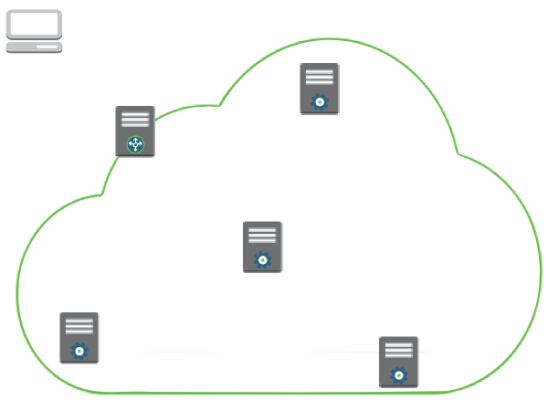
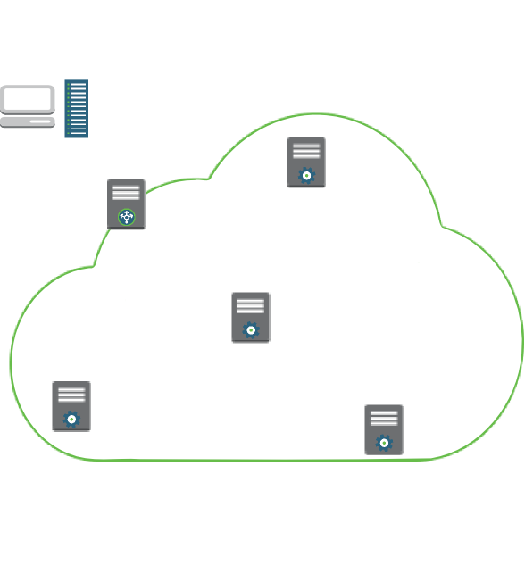
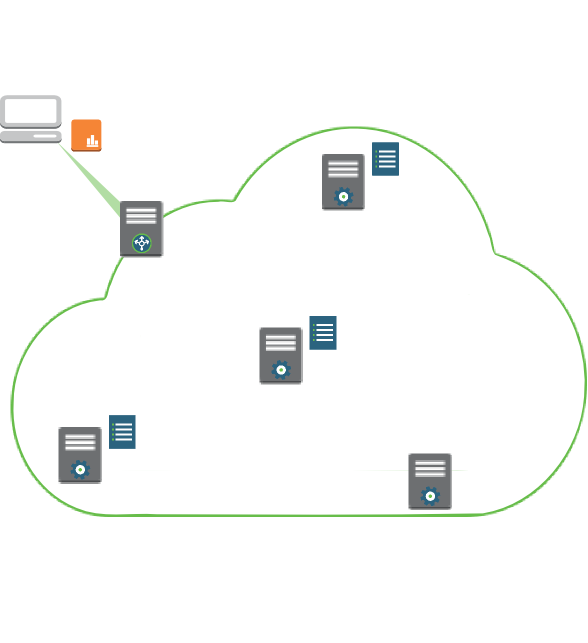
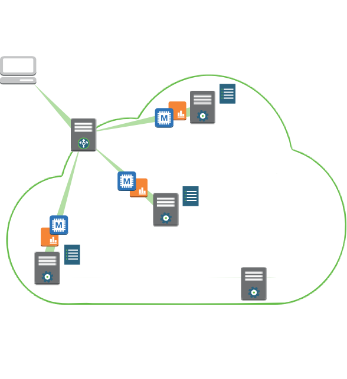
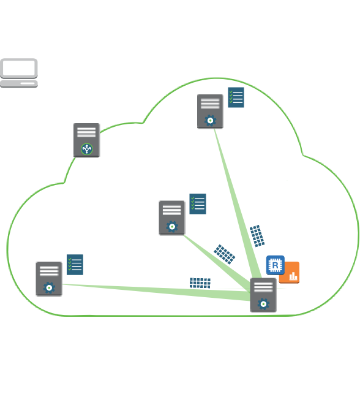
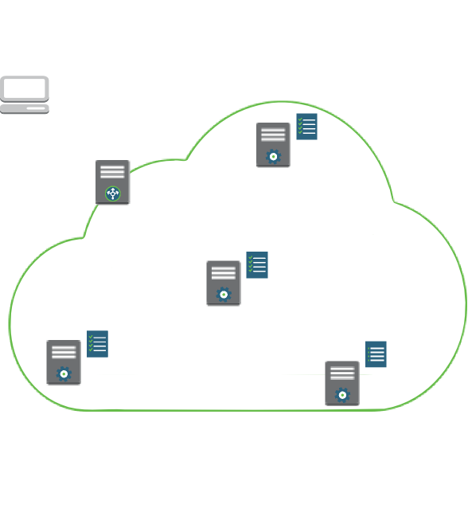
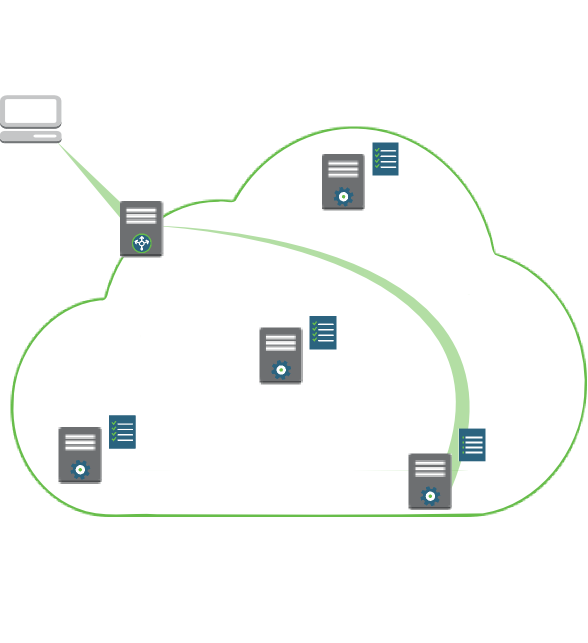

## Learning goals

This section should teach participants:

1. What Hadoop is
2. Current R/Hadoop integrations
3. *When* to use R with Hadoop (guidelines)
4. *How* to use R with Hadoop (lab)


#  <span style="position: relative; left:-60px; margin-right:-80px; top: 40px;"></span>  Brief introduction to Hadoop


## Hadoop

**Key ideas:** enables distributed computing; open source; widely used

<div class="red3">
>   <br />
> The Apache Hadoop project develops open-source software for reliable, scalable, distributed computing. The Apache Hadoop software library is a framework that allows for the distributed processing of large data sets across clusters of computers using simple programming models. It is designed to scale up from single servers to thousands of machines, each offering local computation and storage...
>  <br />
>  <br />
> Source: [Apache Software Foundation - What is Apache Hadoop?](http://hadoop.apache.org/#What+Is+Apache+Hadoop%3F) 

</div>

<br />

Hadoop is one of the older, more mature modern "cloud computing" technologies in use today.


## Key features

Two of Hadoop's main features are particularly relevant to this talk:

| Feature | Solves problem |
| :- | :- |
| Distributed storage | How do we easily store and access large datasets? |
| Distributed/batch computing | How do we quickly run analyses on large datasets? |


## Overview {.flexbox .vcenter}

1.&nbsp; Hadoop links together servers to form a (storage + computing) cluster.

<span style="position:relative; top:30px"></span>

## Overview {.flexbox .vcenter}

1.&nbsp; Hadoop links together servers to form a (storage + computing) cluster. 

<span style="position:relative; top:30px"></span>


## Overview {.flexbox .vcenter}

2.&nbsp; Creates a distributed file system called **hdfs** which splits large data files into smaller pieces that servers across the cluster store.

<span style="position:relative; top:-86px"></span>


## Overview {.flexbox .vcenter}

2.&nbsp; Creates a distributed file system called **hdfs** which splits large data files into smaller pieces that servers across the cluster store.

<span style="position:relative; top:-86px"></span>

    
## Overview {.flexbox .vcenter}

3.&nbsp; Uses the MapReduce programming model to implement <br/>&nbsp;&nbsp;&nbsp;&nbsp; distributed  (i.e., parallel) computing.

<span style="position:relative; top:-86px"></span>


## Important interlude!

**Hadoop uses distributed storage to facilitate distributed computing**

MapReduce achieves parallelization by running separate copies of an analysis  on the smaller pieces of data files stored across the cluster.  Parallelization will not occur when a data file is "too small" to be split into smaller pieces <br/> (traditional defaults are less than 64MB or 128MB). 

<br/>
**MapReduce programs have 3 main stages**

1. **Map:** Apply a function to *extract* and *group* "data" from all records in a dataset
2. **Shuffle/sort:** Sort the function's outputs
3. **Reduce:** *Compute* summaries of the grouped outputs
    
    
## Overview (MapReduce) {.flexbox .vcenter}

3.a.&nbsp; Users upload *Map* and *Reduce* analysis code to Hadoop.

<span style="position:relative; top:-55px"></span>

## Overview (MapReduce) {.flexbox .vcenter}

3.b.&nbsp; Hadoop distributes the *Map* code to the servers with the data. These servers runs local analyses that extract and group data.

<span style="position:relative; top:-86px"></span>

## Overview (MapReduce) {.flexbox .vcenter}

3.c.&nbsp; Hadoop merges extracted data on one or more separate servers.  These servers run the *Reduce* code that computes grouped data summaries.

<span style="position:relative; top:-86px"></span>

## Overview (MapReduce) {.flexbox .vcenter}

3.d.&nbsp; Hadoop stores analytic results in its distributed file system, **hdfs**, on the server(s) that ran the Reduce code.

<span style="position:relative; top:-86px"></span>


## Overview (MapReduce) {.flexbox .vcenter}

3.e.&nbsp; Analysts can retrieve these results for review or follow-on analysis.

<span style="position:relative; top:-55px"></span>

## Hadoop - Natural strengths

- Extract data
- Group data
- Compute group summaries

<!--
Hadoop's natural computing strength is to apply a function to **extract** "data" from each record in a dataset, **group** the function's outputs, and **compute** summaries of the grouped outputs.

    *Examples:* 
    
    1. Given a dataset of tax records for many individuals, you could easily **extract** salaries, **group** them by city, and **compute** average salaries by city with Hadoop.
    
    2. Given a large collection of Twitter tweets, with Hadoop you could easily apply natural language processing algorithms to **extract** tweet topics, **group** by date, and **compute** the most popular topics over time.
-->
    
## Hadoop - Natural "weaknesses"

"Everything else"

- Iterative algorithms
- Multi-step workflows

<!--
Although this is getting better, Hadoop less naturally applies iterative algorithms to datasets since iterative algorithms don't as immediately fit into the **extract**, **group**, and **compute/summarize** pattern.

    *Examples:*
    
    1. Given the same collection of tweets, it would take more programming and computational effort to compute clusters of users who most often discuss similar topics.
    
    2. Given a large dataset of sales records, it would take more programming and computational effort  to use the entire dataset to fit a logistic regression model that could help predict which customers will buy different products based on demographic information.
    
    *Note:* Sometimes data storage tricks and approximate algorithms can be used to help achieve efficient parallelization for these and related types of problems.
-->


# <span style="position: relative; left:-60px; margin-right:-50px; top: 35px;"></span> R/Hadoop integrations

<!---
# <span style="position: relative; left:-60px; margin-right:-80px; top: 33px;"></span> R/Hadoop integrations
--->

## Key integration projects

| Project | Sponsors/Maintainers | 
| :- | :- | 
| RHadoop | RevolutionAnalytics |
| RHIPE | tesseradata |

<br/>

### Integration purposes

- Let people use Hadoop to execute R code
- Let people use R to access data stored in Hadoop


## Consider integrating R and Hadoop when...

Your computing needs align with natural strengths of R and Hadoop

Evaluate alignment with the following factors:

| Factor | Mantra | Guideline | 
| :- | :- | :- |
| R's natural strength | Use R for statistical computing | Consider integrating when your project can be solved using code available in R, or when it is not easily solved in other languages | 
| Hadoop's natural strength | Use Hadoop for distributed storage & batch computing | Consider integrating when your problem requires lots of storage or when it could benefit from parallelization  | 
| Coding effort | Work smart, not hard | R and Hadoop are tools, not "cure-all" panaceas. Consider **not** integrating if it is easier to solve your problem with other tools |
| Processing time | Work smart, not hard (2) | Although some problems can benefit from parallelization, consider **not** integrating if the gains are negligible since this can help you reduce the complexity of your project

## Example applications

| Scenario | Use R/Hadoop? | Why? | Example
| :- | :-: | :- | :- |
| Analyzing small data stored in Hadoop | Y | R can quickly download data analyze it locally | Want to analyze summary datasets derived from map reduce jobs done in Hadoop |
| Extracting complex features from large data stored in Hadoop | Y | R has more built-in and contributed functions that analyze data than many standard programming languages | R is a natural language to use to write an algorithm or classifier that extracts information about objects contained in images |
| Applying prediction and classification models to datasets | Y | R is better at modeling than many standard programming languages | Using a logistic regression model to generate predictions in a large dataset |

## Example applications

| Scenario | Use R/Hadoop? | Why? | Example
| :- | :-: | :- | :- |
| Implementing an "iteration-based" machine learning algorithm | Maybe | 1) Other languages may be faster than R for your analysis, 2) Hadoop reads and writes a lot of data to disks, other "big data" tools, like Spark (and SparkR) are designed for speed in these scenarios by working in memory | Training a k-means classification algorithm or logistic regression on a large dataset |
| Simple pre-processing of large data stored in Hadoop | N | Standard programming languages are much faster than R at executing many basic text and image processing tasks | Pre-processing twitter tweets for use in a natural language processing project |


# <span style="position: relative; left:-60px; margin-right:-70px; top: 30px;"></span> Lab - Use R/Hadoop

## Lab goals

<!--- make these goals more "goal like" --->

1. Present an example of a problem to integrate
1. Connect to Hadoop via R
2. Work through a basic integration
3. Modify the analysis on your own

## Lab problem (simplified)

- A car insurance company launched a **small pilot study** to evaluate a new program they
are considering offering to all of their customers.  At the end of the study the participants
were asked whether or not they would like to stay enrolled in the offering.  

- The company
would like to use the participants' **demographic information** and their feedback to help 
**predict** whether the program can be **profitable** if offered to all customers.  

- For marketing
purposes, they are additionally interested in knowing if the program is very
popular with specific subsets of their customers.

Business questions:

- Keep the program?
- Focus marketing to specific groups?

## Analytic approach (simplified)

1. In R, build a logistic regression model from the pilot study data
2. Use RHadoop to use the regression model to predict which customers would
   like in the program (map) and combine the results (reduce)
3. Use RHadoop to retrieve the summary data and conduct follow-on analyses in R or build 
   charts and tables to help present the data


### This will demonstrate...

- Applying prediction and classification models to Hadoop data (customers)
- Analyzing small data stored in Hadoop (summary data)


## Connect to Hadoop (via command line)


- Log in to a server that can submit MapReduce jobs to Hadoop
    <p style="margin-left:30px;">
            ```ssh cloudera@192.168.1.105``` &nbsp;&nbsp; (password: ```cloudera```)
         </p>
         
- Start R
    <p style="margin-left:30px;">
            ```R```
         </p>
         
- Within R...
    - Load key RHadoop library
         <p style="margin-left:30px;">
            ```library(rmr2)```
         </p>
    - Tell RHadoop where to find Hadoop commands
        <p style="margin-left:30px;">
            ```Sys.setenv(HADOOP_CMD='/usr/bin/hadoop')```<br/>
            ```Sys.setenv(HADOOP_STREAMING='/usr/lib/hadoop-0.20-mapreduce/contrib/streaming/hadoop-streaming.jar')```
         </p>
         
<!---
```
ssh -o StrictHostKeyChecking=no -o UserKnownHostsFile=/dev/null cloudera@192.168.1.105

```
--->

## Monitor Hadoop (via web browser)

- Open "The Hadoop UI" (HUE)
    - HUE landing page: http://192.168.1.105:8888/
        - Username and password: ```cloudera```
    - View status of MapReduce jobs: http://192.168.1.105:8888/jobbrowser/
    - View contents of **hdfs**: http://192.168.1.105:8888/filebrowser/#/


## Load and fit training data

- Load data from pilot program
```{r, eval=F}
  pilot.path = '/CSP/data/insurance/pilotProgram_results.csv'
  pilot = from.dfs(pilot.path, format='csv')
  pilot.data = pilot$val
  colnames.path = '/CSP/data/insurance/columnNames.csv'
  data.colnames = from.dfs(colnames.path, format='csv')
  colnames(pilot.data) = t(data.colnames$val)
```
    
- Fit logistic regression model to data
```{r, eval=F}
  pilot.fitted = glm(stay ~ ., binomial, pilot.data)
```
    
- Reduce model and view results
```{r, eval=F}
  library(MASS)
  pilot.fitted.reduced = stepAIC(pilot.fitted)
  summary(pilot.fitted.reduced)
```
    
## MapReduce: Apply model to data

- Write mapper
```{r, eval=F}
  predictor.names = t(data.colnames$val)[-1]
  predictor.levels = lapply(pilot.data, levels)[-1]
  predictors.count = length(predictor.levels)
  not.null = function(x) { !is.null(x) }
  columns.forFactors = (1:predictors.count)[sapply(predictor.levels, not.null)]
```
```{r, eval=F}
  prediction.mapper = function(key, customer){ 
        colnames(customer) = predictor.names
        for(factorCol in columns.forFactors) {
          unseenLevels = which(!(customer[,factorCol] %in% predictor.levels[[factorCol]]))
          customer[unseenLevels, factorCol] = NA
        }
        customer.pred = plogis(predict.glm(pilot.fitted.reduced, customer))
        keyval(paste(as.character(customer$region), as.character(customer$gender)),
               ifelse(customer.pred>.5, 1, 0))
  }
```

## MapReduce: Summarize predictions

- Write reducer
```{r, eval=F}
  counting.reducer = function(k, vv) { keyval(k, sum(vv, na.rm=T)/length(vv)) }
```

- Set up and execute MapReduce job
```{r, eval=F}
  mapred.result = mapreduce(
        input = '/CSP/data/insurance/customer_profiles.csv',
        input.format = 'csv',
        output.format = 'csv',
        map = prediction.mapper,
        reduce = counting.reducer
  )
```

- Retrieve analytic results
```{r, eval=F}
  mapred.result.data = from.dfs(mapred.result(), format='csv')
```


## Variations

- Use a different regression/classification model

- Compute more detailed summaries of customer predictions
    - E.g., Group by gender, age, and region
    - E.g., Work with raw estimates and compute averages or variances instead of percentages

- Identify model weaknesses
    - What factor levels are present in customer records but not in pilot records?
    - Which or how many customers have these types of levels?

- Explore functions and objects in ```rmr2``` 
    - Look at ```mapred.result```
    - Write data to **hdfs** in different formats


# Summary

## Stay efficient, stay practical

- Practical computing requires balancing computing speed, programming efficiency, and personal comfort.  R/Hadoop integrations offer more ways to achieve balance.
  
- R/Hadoop integrations give practitioners opportunities to use strengths of both technologies.

- R/Hadoop integrations give R programmers access to "non-R" technologies.


## Topics for further reading


### R/Hadoop integrations

- RHadoop documentation and examples on github
- RHIPE's example analysis of airplane dataset
- Any online tutorial for logistic regression or k-means via R/Hadoop 
- RevolutionAnalytics' integration of ```biglm``` with RHadoop

<!---
https://github.com/RevolutionAnalytics/rhdfs/blob/master/pkg/inst/examples/biglm.integration.r
add the links for these details in handouts
--->

### Hadoop

- Hadoop documentation by Apache, Cloudera, Hortonworks, or others

## Acknowledgements

Logos/Graphics:

- Apache Software Foundation
- Amazon Web Services
- HortonWorks